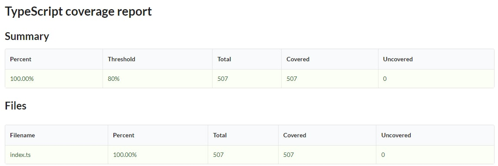

# Pregunta 5 : Diagrama de Tombstone

Este programa ejecuta una implementación de los diagramas de Tombstone como grafos. En el archivo Tdiagram.ts se encuentra el código de la implementación y en el archivo pruebaUNIT.ts se encuentran los tests con los que se realizó el unit test.

## ¿Cómo correr el programa?
El programa puede correrse de manera muy sencilla mediante los comandos:

    tsc Tdiagram.ts
    node Tdiagram.js
    
Se debe tener instalado Typescript y Node.js en el computador, en su última versión.

## Unit Test y Code Coverage
Durante el unit test todas las pruebas terminaron de manera exitosa y se logró un coverage de 100%. Las pruebas fueron realizadas con typescript-coverage-report una herramienta de comandos de Node que permite realizar pruebas y verificar la cobertura del código escrito en Typescript.

La herramienta puede conseguirse aquí: https://github.com/alexcanessa/typescript-coverage-report
